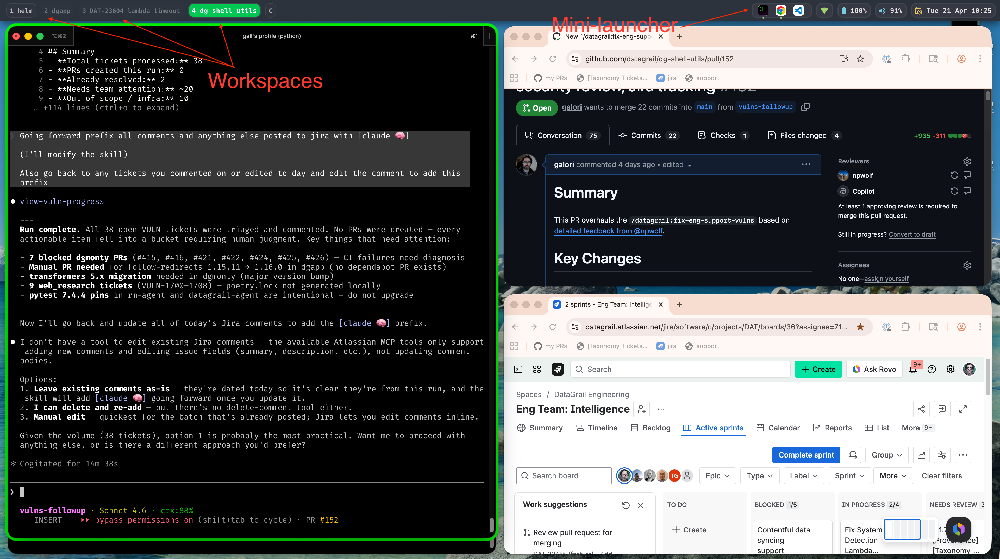

# Hub


A keyboard-first macOS workspace environment that orchestrates [AeroSpace](https://github.com/nikitabobko/AeroSpace) (tiling window manager) and [JankyBorders](https://github.com/FelixKratz/JankyBorders) (window borders) with a native Swift status bar into a unified workspace manager.


<br/>

https://github.com/user-attachments/assets/931a020c-86c1-44b4-8c0b-ad8610f6ebd2

<br clear="all">

## Recommended

Check out the [AeroSpace README](https://github.com/nikitabobko/AeroSpace) - especially the videos, to learn how to use AeroSpace. 

## Keybindings

All keybindings use `Alt` as the modifier (AeroSpace default):

| Key | Action |
|-----|--------|
| `Alt + [1-9, A-Z]` | Switch to workspace |
| `Alt + Shift + [1-9, A-Z]` | Move window to workspace |
| `Alt + H/J/K/L` | Focus left/down/up/right |
| `Alt + Shift + H/J/K/L` | Move window left/down/up/right |
| `Alt + /` | Toggle tiles horizontal/vertical |
| `Alt + ,` | Toggle accordion layout |
| `Alt + -/=` | Resize window |
| `Alt + Tab` | Switch to previous workspace |
| `Alt + Shift + Tab` | Move workspace to next monitor |
| `Alt + ~` | Cycle focus to next window in workspace |
| `Alt + Shift + ~` | Cycle focus to previous window in workspace |
| `Ctrl + Alt + Esc` | Focus back and forth between last two windows |
| `Ctrl + Alt + N` | Create new workspace |
| `Ctrl + Alt + D` | Remove current workspace |
| `Ctrl + Alt + R` | Rename current workspace |
| `Ctrl + Alt + O` | Open all configured apps |
| `Ctrl + Alt + 1-5` | Open specific app slot |
| `Ctrl + Alt + -` | Shrink workspace labels |
| `Ctrl + Alt + =` | Grow workspace labels |
| `Alt + Shift + ;` | Enter service mode |

## Setup

### Install

```sh
git clone <repo-url> ~/workspace/hub
cd ~/workspace/hub
./scripts/hub install
```

This will:
- Check and optionally install dependencies via Homebrew (aerospace, borders)
- Deploy the AeroSpace config to `~/.aerospace.toml`
- Compile Swift binaries (status bar, overlay HUD, workspace dialog, and more)
- Install a `hub` shell alias in your shell config
- Deploy Claude Code slash commands to `~/.claude/commands/`

### Start the environment

```sh
hub up
```

Starts AeroSpace, the native bar, and JankyBorders. Hides the macOS Dock and menu bar for a distraction-free tiled workspace.

### Stop the environment

```sh
hub down
```

Stops all managed services and restores the Dock and menu bar.

### Create a workspace

Press **`Ctrl+Alt+N`** from anywhere to open the new workspace dialog.

Opens a dialog to create a named workspace. Supports picking a git repo (with optional worktree creation), assigning a workspace key (1-9, A-Z), and automatically switching to it with a terminal open at the project path.

CLI alternative: `hub new`

### List workspaces

The status bar displays all workspace labels at all times.

CLI alternative: `hub list` — shows a table of all defined workspaces with their ID, name, path, and root repo.

### Remove a workspace

Press **`Ctrl+Alt+D`** to remove the current workspace (prompts for confirmation).

Removes the workspace from configuration, clears its bar label, and moves any windows to workspace 1. For worktree-backed workspaces, offers to teardown and remove the git worktree.

CLI alternative:
```sh
hub remove        # remove the current workspace (prompts for confirmation)
hub remove A      # remove workspace A
hub remove A -y   # remove without confirmation
```

### Rename a workspace

Press **`Ctrl+Alt+R`** to rename the current workspace.

Opens a dialog to rename the workspace. Updates the bar label immediately.

CLI alternative:
```sh
hub rename        # rename the current workspace
hub rename A      # rename workspace A
```

### Open apps in a workspace

Press **`Ctrl+Alt+O`** to open all configured apps in the current workspace, or **`Ctrl+Alt+1-5`** for individual app slots.

Opens the apps defined in `~/.config/hub/apps.json` in the current workspace. Skips apps already open on the workspace. New windows are automatically moved to the correct workspace.

Default apps: iTerm2, Safari, VS Code. Edit `~/.config/hub/apps.json` to customize (up to 5 slots).

The status bar shows clickable app icons on the right side — full-size when open on the current workspace, dimmed when not.

CLI alternative:
```sh
hub open           # open all configured apps in current workspace
hub open 1         # open just the first configured app (e.g., iTerm)
hub open 2         # open just the second configured app (e.g., Safari)
```

## Guiding Principles

- **Keyboard-first**: Everything should be keyboard-only accessible, similar to how AeroSpace is designed for keyboard use, but also usable with the mouse.
- **UI/CLI parity**: Every action available through a GUI dialog or keybinding must also have an equivalent CLI command.
- **Minimal chrome**: Hide the Dock and menu bar. The native bar provides only what's needed.
- **Single command**: `hub up` to start, `hub down` to stop. No manual config needed after install.

## Development

* If working from a worktree, run `hub reboot` after making changes to get everything running from the worktree path for testing.
* The AeroSpace config in this repo serves as a template. It gets converted to the actual config file and placed in the right location during `hub install`
* AeroSpace
  * AeroSpace is configured via `aerospace.toml`
  * See the docs here: https://github.com/nikitabobko/AeroSpace/blob/main/README.md
  * AeroSpace can also be managed at runtime with the `aerospace` cli. (see `aerospace --help`)
* If working off of a git worktree, to test first install the worktree's version with `scripts/hub install`

## Dependencies

- [AeroSpace](https://github.com/nikitabobko/AeroSpace) - MacOS Spaces alternative for managing workspaces
- [JankyBorders](https://github.com/FelixKratz/JankyBorders) - window borders
- macOS with Homebrew
- Swift compiler (included with Xcode Command Line Tools)
